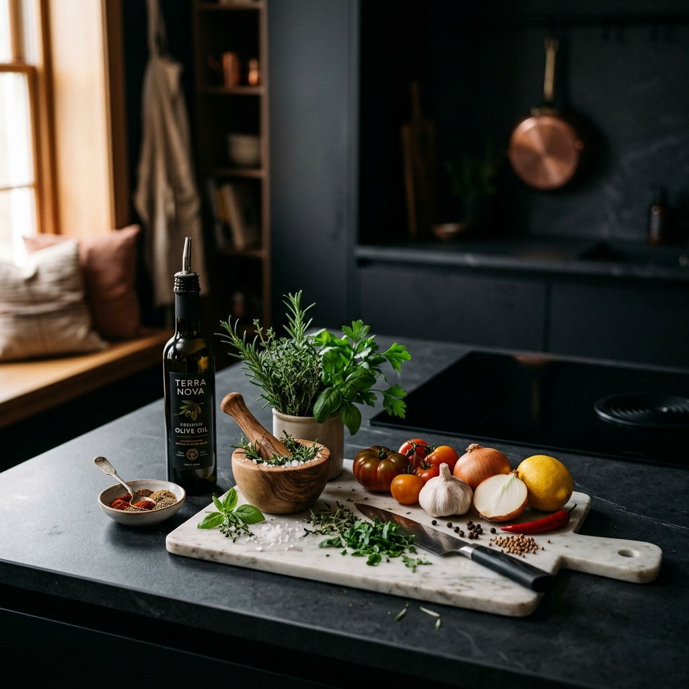

# GourmetLab 🍳
> An elegant, interactive Recipe Book & Weekly Meal Planner built with Python Flask and a glassmorphic Vanilla HTML/CSS/JS frontend.

GourmetLab is a modern web application designed for food enthusiasts who want a clean, aesthetic, and functional space to organize their culinary life. It features dynamic serving size calculations, weekly meal scheduling, and a smart, consolidated grocery shopping list.



---

## ✨ Key Features

1. **Gourmet Dashboard:**
   - View today's planned meals (Breakfast, Lunch, and Dinner) at a glance.
   - Live metrics (Total Recipes, Meals Planned, Grocery Items).
   - *Chef's Daily Feature* — a rotating recipe highlighted daily.

2. **Recipe Explorer:**
   - Search by recipe titles and descriptions.
   - Filter instantly by culinary categories (Breakfast, Lunch, Dinner, Dessert, Snack) using interactive pills.
   - Cards display preparation and cook times.

3. **Interactive Recipe Details (Serving Scaler):**
   - Scale ingredients dynamically on the fly with `-` and `+` controls. Adjusting serving sizes automatically recalculates ingredient measurements.
   - Interactive checklist for ingredients so you can cross things off as you cook.
   - Checklist memory is saved to `localStorage`, preserving your progress if you refresh the page.

4. **Weekly Meal Planner:**
   - 7-day grid showing Breakfast, Lunch, and Dinner slots.
   - Quick-select dropdowns in empty slots to plan meals instantly.
   - One-click clear to reset your weekly plan.

5. **Smart Grocery List:**
   - Compiles ingredients from all scheduled meals automatically.
   - Consolidates quantities (e.g., merging `0.5 cups milk` + `1.5 cups milk` into `2.0 cups milk`).
   - Groups items by supermarket department (Produce, Meat, Dairy, Pantry, Spices).
   - "Copy List" to copy a beautifully formatted shopping list to your clipboard, or "Print List" to print.

6. **Recipe Creator:**
   - Add your own custom recipes with descriptions, times, servings, and custom images.
   - Dynamically add/remove ingredient rows and instruction steps.

---

## 🛠️ Technology Stack

- **Backend:** 
  - Python 3.11+
  - Flask (Web framework & REST API)
  - SQLite3 (Local relational database)
- **Frontend:**
  - Semantic HTML5
  - Vanilla CSS3 (Custom variables, glassmorphic filters, responsive grids, micro-animations)
  - Vanilla JavaScript (SPA routing, Fetch API state synchronization, servings scaling math)

---

## 📂 Project Directory Structure

```text
flask_recipe_planner/
├── app.py                 # Main Flask application & API routes
├── database.db            # SQLite database (auto-created)
├── models.py              # SQLite helper functions and business logic
├── schema.sql             # SQL script to initialize/seed tables
├── README.md              # Project documentation
├── .gitignore             # Configured to ignore caches and local databases
├── templates/
│   └── index.html         # Main dashboard template (Single Page App)
└── static/
    ├── css/
    │   └── style.css      # Premium dark-mode stylesheet
    ├── js/
    │   └── app.js         # Frontend controller and routing logic
    └── images/            # Local asset folder for recipe images
```

---

## 🚀 Getting Started

### Prerequisites
Make sure you have Python 3 installed. You can check by running:
```bash
python --version
```

### Installation & Setup

1. **Clone or Navigate to the Directory:**
   ```bash
   cd C:\Users\hashm\flask_recipe_planner
   ```

2. **Install Flask:**
   If you don't have Flask installed yet, run:
   ```bash
   pip install flask
   ```

3. **Database Initialization (Automatic):**
   The application automatically initializes `database.db` and populates it with 3 gourmet starter recipes (Avocado Sourdough Toast, Tuscan Garlic Chicken, and Mediterranean Quinoa Salad) on the first launch.

4. **Run the Server:**
   ```bash
   python app.py
   ```

5. **Access the App:**
   Open your browser and navigate to:
   **[http://127.0.0.1:5000/](http://127.0.0.1:5000/)**

---

## 🗄️ Database Design

GourmetLab uses an SQLite database with four tables configured with cascading deletes:
- `recipes`: Holds basic metadata about each recipe.
- `ingredients`: Holds quantities, units, and departments mapped to a recipe.
- `instructions`: List of recipe instructions ordered by step number.
- `meal_plan`: Map of calendar day, meal type (Breakfast, Lunch, Dinner), and recipe ID.
